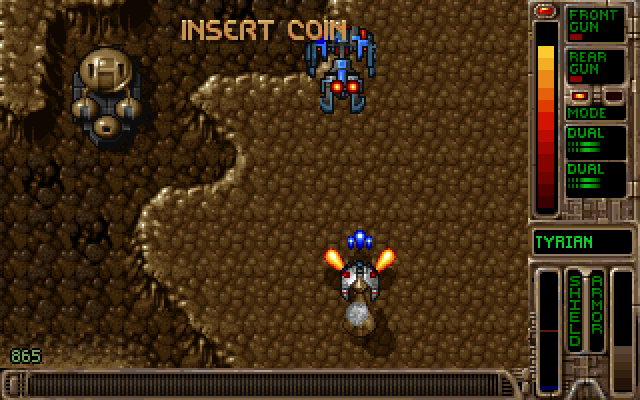
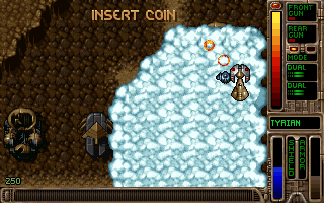

# OpenTyrian — wasmcart port

[](https://github.com/wasmcart/opentyrian/actions/workflows/build.yml)
[](https://github.com/wasmcart/opentyrian/releases/latest)
[](COPYING)
[](https://wasmcart.org)

[OpenTyrian](https://github.com/opentyrian/opentyrian) — the open-source port of
the 1995 DOS shooter **Tyrian** — built as a [wasmcart](https://wasmcart.org)
cart: one `.wasc` file that runs on any conforming host, whether that is a
browser, Node, the native player, or a libretro core in RetroArch.

**[wasmcart.org](https://wasmcart.org)** · [the spec and reference
host](https://github.com/wasmcart/wasmcart) ·
[download the cart](https://github.com/wasmcart/opentyrian/releases/latest)





Captured from the cart itself, running through a wasmcart host.

## It ships complete

Tyrian's data files were **released as freeware** by the publisher, so this cart
is playable the moment you download it. Most classic-game ports cannot say that —
they need you to supply original game files. `pack.sh` fetches the data from
[camanis.net](https://camanis.net/tyrian/tyrian21.zip) at build time rather than
committing it.

## Play

Grab the `.wasc` from
[Releases](https://github.com/wasmcart/opentyrian/releases/latest) and run it with
any wasmcart host:

```sh
npx wasmcart opentyrian.wasc
```

### Controls

Tyrian is an arrow-keys-and-fire game, so it maps onto a gamepad cleanly — that
is why it was chosen for porting over a cursor-driven game.

| Pad | Action |
|---|---|
| d-pad / left stick | move the ship |
| **A** | fire |
| **B** | rear weapon mode |
| **X** / **Y** | left / right sidekick |
| **START** | confirm |
| **SELECT** | pause / back |

## Build

Needs the [Emscripten SDK](https://emscripten.org) and the
[wasmcart-sdl2](https://github.com/wasmcart/wasmcart-sdl2) backend checked out
alongside this repo.

```sh
# once: build SDL2 with the wasmcart backends
EMSDK=/path/to/emsdk ../wasmcart-sdl2/sdl2_wc/build_sdl2_wc.sh

bash build.sh    # -> build/opentyrian.wasm
bash pack.sh     # -> build/opentyrian.wasc   (fetches the game data)

# optional: grant the cart a relay domain for dial-out multiplayer
WASMCART_WS=relay.example.com bash pack.sh
```

`build.sh` compiles with `-DWITH_NETWORK`, so the peer transport is always
available; whether multiplayer actually happens is up to the host (see
[Networking](#networking)).

`libSDL2_wc.a` is not committed anywhere: it is toolchain-specific, built against
a particular emsdk's SDL port, so a mismatched one produces silent ABI problems.

## How the port works

Four small edits to the game plus a handful of new files. Not a rewrite — the
game logic, assets and feel are the original's.

**One frame boundary.** The game draws a 320×200 8-bit paletted surface and
pushes it to the screen through exactly one function, `JE_showVGA()`. All 79 draw
sites funnel through there, so `src/video.c` intercepts that single function:
convert the paletted surface into the cart framebuffer, then yield.

**Loop inversion instead of restructuring.** The game owns its loop — `main()`
calls `titleScreen()` and `JE_main()`, which spin internally, and there are 86
`delayUntilElapsed()` sites scattered through the code. Turning that into a
per-frame step function would mean rewriting the game. Instead the cart uses
wasmcart's asyncify loop inversion: the game runs until it flips a frame,
`wc_frame_yield()` unwinds the whole stack out to the host, and the next
`wc_render()` rewinds back to exactly that point. Nothing in the game notices.

**Files come from the cart, not a filesystem.** `src/file.c` shims `dir_fopen()`
onto `wc_load_asset()` + `fmemopen()`. All three `dir_fopen_*` variants and
`dir_file_exists()` funnel through it, so the roughly 300 stdio calls in the rest
of the game are untouched and keep working on a normal `FILE*`.

**Saves go to the cart save region.** `get_user_directory()` returns a sentinel in
cart builds, which is how `dir_fopen()` tells a save file from a shipped data
file: saves are routed to
[`wc_savefs`](https://github.com/wasmcart/wasmcart-sdl2/blob/main/include/wc_sdl_savefs.h)
(named files over `wc_info_t.save_ptr`), data stays read-only. The host persists
the region, so `tyrian.cfg`, `opentyrian.cfg` and `tyrian.sav` survive a relaunch
wherever the host keeps them — a file, browser storage, libretro SRAM.

The game writes its config on the way out of `main()`, which a cart never reaches,
so the cart exports `wc_on_suspend` and saves there instead. Progress needed no
help: `JE_saveGame()` already calls `saveSaves()` itself.

**Multiplayer maps onto the peer ABI.** Upstream's netcode is SDL_net UDP, and
`src/network.c` is unchanged — `src/network.h` includes
[`wc_sdl_net.h`](https://github.com/wasmcart/wasmcart-sdl2/blob/main/include/wc_sdl_net.h)
instead of `SDL_net.h` for cart builds, which implements the same calls over
`wc_peer_*`. A UDP datagram and a peer message are near enough the same thing
(discrete, bounded, unreliable) that the game's own sequencing and acknowledgement
carry over untouched. See [Networking](#networking) below.

**Input drives the game's own key array.** `keysactive[]` is a plain scancode
array, so the pad writes into it directly. That is less code than standing up a
fake SDL joystick, and it means menus, gameplay and the ship editor all work
without touching any per-screen input handling.

**Audio needed no work.** The game opens a normal SDL audio device with a pull
callback, and the wasmcart SDL2 backend already bridges that to the host's ring
buffer.

### Traps, recorded so the next port skips them

- **`sdl2_gl_blit.c` is deliberately not linked.** It imports 25 GL functions,
  and a cart that imports anything from the `gl` module is treated as a GL cart
  by the host — which then reads frames back from a GL context this cart never
  draws into, and every frame arrives blank. This game is pure software
  rendering, so `src/gl4es_stub.c` satisfies the linker instead and the cart
  imports zero GL symbols.
- **`-sUSE_SDL=0` is link-only.** Passing it while compiling swaps in
  Emscripten's `fakesdl` headers and every SDL type goes undeclared, so compile
  and link have to be separate steps.
- **A wait loop that does not draw will deadlock the cart.** `keyboard.c` has five
  `while (true) { poll; if (input) return; SDL_Delay(); }` loops, and the intro
  logos and every menu prompt sit in one. None of them draw, so none reach
  `JE_showVGA()` — the cart spins inside the wait while the host waits for it to
  return, unable to deliver the very button press the loop wants. The fix is to
  yield on `SDL_Delay()` as well as on a frame flip: its whole meaning is "I have
  nothing to do right now", which is exactly when a cart should hand the frame
  back. Presents as "hangs a few seconds in", which looks like a crash.
- **`fsync(fileno(f))` does not return on an `fmemopen` stream.** The save paths
  bracket writes with `mkdir()` and `fsync()`; a save handle has no descriptor, so
  `fileno()` gives -1. Both are stubbed for cart builds — the host owns durability
  — and the stubs must come *after* `<sys/stat.h>`/`<unistd.h>` or they mangle
  libc's own declarations.
- **Routing `fclose` through a macro can recurse.** Hooking the game's 30-odd
  `fclose()` calls with a macro is the sensible move, but the save layer calls
  `fclose()` internally too, so it has to `#undef` the macro or the calls recurse
  forever. Silent hang at *cart load*, nothing like a save bug.
- **`WC_SAVEFS_IMPLEMENTATION` belongs in exactly one .c file.** Two copies of the
  save filesystem means one of them has `cap == 0`, where `fopen` succeeds and
  every `fwrite` short-writes: the game reports "failed to write" and saves vanish.

## Networking

Two-player Tyrian works over wasmcart's peer transport, **if the host provides
peers**. That is a real condition, not a hedge: `wc_peer_*` deliberately hides
transport, so whether peers exist at all is the host's decision.

The cart declares `WC_FLAG_NET_PEER` and ships with **no relay domain baked in**.
Which relay to trust is the player's or host's call, not something a game should
decide. So there are two ways a session happens:

- **The host supplies the peer** (`addPeer()` — a lobby, a matchmaker, a relay
  room). Nothing to grant, nothing to configure, and this is the path a real host
  should use.
- **The cart dials out**, which needs a manifest grant. Build a cart for a relay
  you run:

  ```sh
  WASMCART_WS=relay.example.com bash pack.sh
  ```

The cart decides single-player vs networked from `wc_peer_count()` on its first
frame — peers only exist if the host arranged them, so a cart launched normally
plays single-player and one launched into a session plays networked, with no extra
UI. The host must register peers before the first frame.

Verified against the WebSocket relay in the wasmcart test suite
(`test/wsserver.mjs`, `/relay/<room>`): two carts in one room, datagrams crossing
the relay byte-identical and arriving on the cart's `wc_peer_on_message`. The shim
itself is unit-tested in
[`wasmcart-sdl2/test/net_test.c`](https://github.com/wasmcart/wasmcart-sdl2/blob/main/test/net_test.c).

### What cannot work: finding games on a LAN

Upstream Tyrian expects you to know your opponent's host and port. Under a peer
transport there is no equivalent, and **peer discovery cannot be shimmed** —
browsers cannot send UDP broadcast or multicast at all, at any privilege level.
That is a platform property, not a gap in this port.

A host that wants LAN-style "find a game" has to virtualise it: a rendezvous
server, a relay room, a signalling channel, and then hand the results to the cart
as peers. `wc_peer_broadcast()` sends to peers *already connected* — it is not
discovery. A future ABI version could define a generic discovery contract that
hosts implement however they can (real multicast natively, a rendezvous service in
a browser), but nothing today does.

## Known gaps

- **The in-game two-player flow still expects a host/port.** The transport works
  and the handshake packets flow, but upstream's connect screen is written around
  entering an address. A host-supplied session sidesteps it; a nicer in-game
  flow would mean touching the menu code, which this port deliberately does not.

## Building the original (non-wasmcart)

Upstream's build is untouched and still works — see `README` and the
[OpenTyrian repo](https://github.com/opentyrian/opentyrian).

## Licensing

OpenTyrian is GPL-2.0 (`COPYING`), unchanged. The Tyrian 2.1 data files are
freeware, redistributed by permission of the original publisher; they are not
committed here and are fetched at build time.
